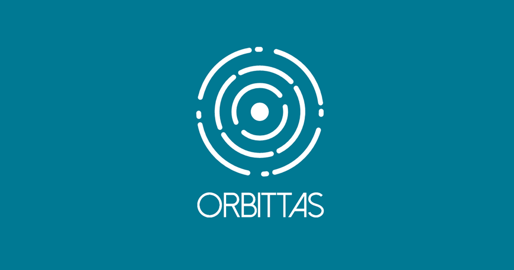

# Pagina de ORBITTAS

Pagina web de la Agencia Digital llamada Orbittas

[Ver la Pagina](https://jesusrojasweb.github.io/orbittas/)

## ¿Cómo funciona?

Requiere Node.JS

* `npm install` para instalar las dependencias.
* `gulp` para el entorno de desarrollo y entorno de producción